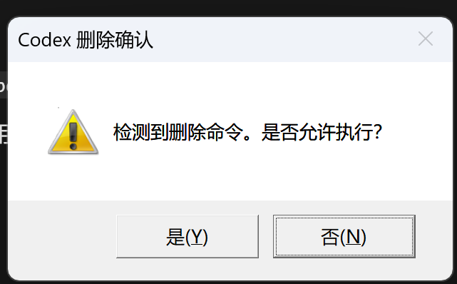

# delete-confirmation-hook
在code agent执行rm等高危删除操作前，出现弹窗征求用户确认的插件hook；
目前仅支持Windows系统Codex APP，后续将实现优化描述、兼容Mac系统等开发任务；



用户在本机安装时执行：

```powershell
codex plugin marketplace add mutou01/delete-confirmation-hook --ref main
codex plugin add delete-confirmation-hook@delete-confirmation-hook
```

第一条命令会克隆并注册 GitHub 市场；第二条根据 `.agents/plugins/marketplace.json` 中的市场名和插件名安装插件。

安装后可确认状态：

```powershell
codex plugin list
```

更新仓库后，用户可刷新市场并重新安装：

```powershell
codex plugin marketplace upgrade delete-confirmation-hook
codex plugin add delete-confirmation-hook@delete-confirmation-hook
```

也可以使用完整 GitHub 地址：

```powershell
codex plugin marketplace add https://github.com/mutou01/delete-confirmation-hook.git --ref main
```
